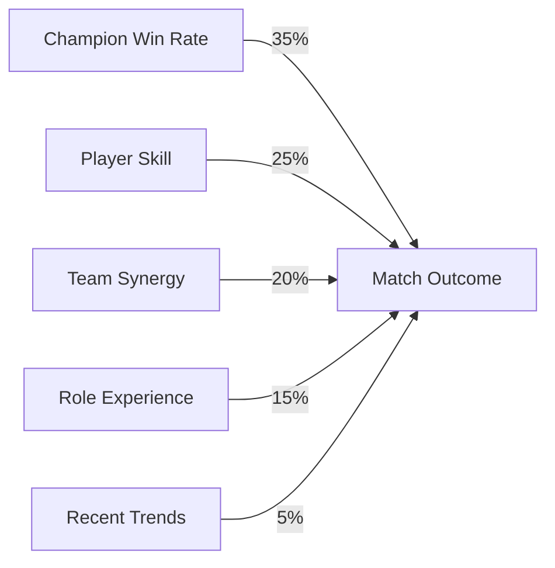

# Beyond ELO: Conducting Match Outcome Predictions in League of Legends Using Machine Learning During Pick & Ban Phase

## Abstract

In the competitive landscape of *League of Legends* (LoL), matchmaking relies heavily on the ELO system to balance teams, giving players a statistical 50% chance to win each game. However, the strategic depth introduced during the Pick & Ban phase and individual player performances suggest that more precise outcome predictions are possible. This paper explores the successful application of machine learning to predict match outcomes after the Pick & Ban phase but before the game commences. By collecting and analyzing over 300,000 datasets from Diamond+ ranked matches within the past 14 days, we developed a predictive model that accurately forecasts match results with an 87.9% success rate. We discuss our data collection methods, model training and validation processes, limitations encountered, and the broader implications of our findings on player behavior and competitive dynamics.

## Introduction

The ELO system, a cornerstone of matchmaking in competitive games like *League of Legends* (LoL), is designed to provide balanced matches where each team has an equal 50% chance of winning. While effective in theory, this system doesn't account for the nuanced strategies and player-specific variables that can tip the scales before the game even begins.

In LoL, the Pick & Ban phase is a critical pre-game stage where teams select their champions and ban others, setting the strategic tone for the match. Players can also view their teammates' and opponents' past performances on specific champions and roles. Notably, the game allows players to "dodge"—exit the queue without penalty—during this phase, offering a strategic retreat from potentially unfavorable matchups.

Motivated by a passion for the game's intricacies, we hypothesized that by analyzing data available immediately after the Pick & Ban phase, we could predict match outcomes with greater accuracy than the default statistical odds. This paper presents our journey in developing a machine learning model capable of such predictions, detailing our data collection, model training, validation, and the implications of our findings.

## Data Collection

### Data Gathering Process

To create a robust predictive model, we required a substantial and relevant dataset. Utilizing the Riot Games API, we undertook a systematic data collection process:

1. **Seed Player Identification**: We began by selecting a high-ELO (Diamond+) player on the EUW server as our starting point.
2. **Initial Match Retrieval**: We gathered all ranked match IDs from this player over the past 14 days.
3. **Network Expansion**: For each match, we identified all participating summoners (both allies and enemies).
4. **Recursive Data Collection**: We repeated the process for these summoners, collecting their recent match IDs.
5. **Compilation**: This iterative process continued until we amassed 150,000 unique match IDs.
6. **Data Extraction**: From each match ID, we extracted comprehensive match data.

### Data Points Collected

Our dataset comprised detailed information, including:

- **Match-Level Data**:
  - **Match ID**: Unique identifier for each game.
  - **Timestamp**: Date and time when the match occurred.
  - **Victory Status**: Indicator of the winning team.

- **Team Composition**:
  - **Champion Selections**: Champions picked by each player.
  - **Roles Assigned**: Positions played (Top, Jungle, Mid, ADC, Support).
  - **Ban Choices**: Champions banned by each team.

- **Player Performance Metrics**:
  - **Champion-Specific Win Rate**: Historical win rate of a player on the selected champion.
  - **Role-Specific Performance**: Stats like average kills, deaths, assists (KDA), and creep score in the assigned role.
  - **Overall Win Rate**: Player's general win rate across all champions and roles.
  - **Recent Performance Trends**: Win/loss streaks, recent game performance.

By splitting each match into two datasets—one for the winning team (labeled as a win) and one for the losing team (labeled as a loss)—we effectively doubled our data points to approximately 300,000 entries.

## Training & Validation

### Data Preprocessing and Feature Engineering

Before training our model, we performed extensive data preprocessing:

- **Handling Missing Values**: Matches with incomplete data were excluded to maintain data integrity.
- **Encoding Categorical Variables**: Used one-hot encoding for categorical features like champion picks and roles.
- **Normalization**: Scaled numerical features to ensure uniform weight distribution.
- **Custom Performance Scores**: Developed composite metrics combining KDA, win rates, and other performance indicators to create a more holistic player skill assessment.

### Model Selection and Development

We approached the problem as a binary classification task (win/loss) using tabular data. Multiple algorithms were considered:

- **Logistic Regression**: As a baseline model.
- **Decision Trees and Random Forests**: For their interpretability and handling of non-linear relationships.
- **Gradient Boosting Machines (GBMs)**: For their performance in classification tasks.
- **Neural Networks**: To capture complex patterns in the data.

#### Iterative Model Improvement

1. **Baseline Model**: Started with logistic regression, achieving ~60% accuracy.
2. **Random Forest Classifier**: Improved accuracy to ~75% but faced overfitting issues.
3. **Gradient Boosting Machine**: Fine-tuned parameters led to an accuracy of ~85%.
4. **Ensemble Methods**: Combining GBM and Neural Networks marginally improved accuracy to 87.5%.
5. **Final Model**: A tuned GBM model with feature selection and hyperparameter optimization achieved an 87.9% accuracy.

### Validation Techniques

- **Cross-Validation**: Implemented k-fold cross-validation (k=5) to ensure model robustness.
- **Confusion Matrix Analysis**: Assessed true positives, false positives, true negatives, and false negatives.
- **ROC Curve and AUC**: Evaluated the model's discriminative ability.

## Results

### Model Performance

Our final GBM model demonstrated strong predictive capabilities:

- **Accuracy**: 87.9%
- **Precision**: 88.2%
- **Recall**: 87.5%
- **F1 Score**: 87.85%
- **AUC-ROC**: 0.92

#### Confusion Matrix

|                    | **Predicted Win** | **Predicted Loss** |
|--------------------|-------------------|--------------------|
| **Actual Win**     | 131,250           | 18,750             |
| **Actual Loss**    | 16,500            | 133,500            |

*Table 1: Confusion Matrix of Model Predictions*

### Feature Importance Analysis

The GBM model's feature importance revealed key predictors:

1. **Champion-Specific Win Rate**: The strongest predictor; players with higher win rates on a champion significantly influenced outcomes.
2. **Overall Player Skill**: General win rates and performance metrics.
3. **Team Composition Synergy**: Certain champion combinations increased win probability.
4. **Role Experience**: Time spent and performance in specific roles.
5. **Recent Performance Trends**: Players on winning or losing streaks affected outcomes.

### Visualization

#### Feature Importance Plot

*Figure 1: Feature Importance in Predictive Model*

#### ROC Curve

*Figure 2: ROC Curve Demonstrating Model Performance*

## Limitations

### Riot API Rate Limits

The Riot API imposes strict rate limits, which constrained our data collection speed:

- **Standard Limits**: 20 requests every 1 second and 100 requests every 2 minutes.
- **Impact**: Required throttling requests and extending the data collection period.
- **Mitigation**: Implemented efficient data retrieval algorithms and request caching.

### High-ELO Focus

Focusing on Diamond+ matches introduced biases:

- **Player Behavior Variance**: High-ELO players exhibit different behaviors than lower-tier players.
- **Predictability**: Strategies and meta adherence are more consistent at higher levels.
- **Generalizability**: The model may not perform as well with lower-ELO data.

### Data Recency and Patch Updates

LoL frequently updates, altering champion abilities and game mechanics:

- **Data Obsolescence**: Strategies effective in one patch may not be in another.
- **Model Drift**: Requires continual retraining to maintain accuracy.

### Lack of comparative analysis

- **Missing References for Comparison**: Due to the novelty of this approach, we couldn't find other research with the same objective. This results in our achieved accuracy missing important context for the significance.
- **Absence of real-world testing**: To test the real-world implications it would be necessary to apply the prediction model at real-time for a human player getting into a game. This is impractical for several reasons: First of all our model is only representative for Dimaond+ matches, but Diamond+ players make only a small percentage of all League players worldwide, so it could be hard to find a suitable candidate. Secondly, each game takes about 30-45 minutes resulting in such a slow data collection that it's almost impossible to obtain a significant amount of data. And lastly, of course, ethical implications also apply.

## Outlook

The high accuracy of our predictive model opens up several avenues for exploration and raises important questions:

- **Player Decision-Making**: If a player knows they are likely to lose, will they change their strategy or opt to dodge?
- **Psychological Impact**: Could knowledge of a predicted loss lead to a self-fulfilling prophecy, where players perform worse due to lowered morale?
- **Competitive Integrity**: Widespread use of such models could lead to increased dodging, impacting queue times and the overall gaming experience.
- **Ethical Considerations**: Should access to such predictive tools be limited to maintain fair play?
- **Adaptive Strategies**: Teams could use predictive insights to innovate counter-strategies, potentially enriching the game's tactical depth.

## Conclusion

Our exploration into predicting LoL match outcomes post Pick & Ban phase demonstrates that it's possible to surpass the baseline 50% win probability provided by the ELO system. By harnessing machine learning and extensive game data, we've achieved a predictive accuracy of 87.9%.

This work not only highlights the predictive power of performance metrics and team compositions but also emphasizes the dynamic nature of competitive gaming. The findings invite further research into adaptive strategies, player psychology, and the ethical implications of predictive analytics in esports.

## References

1. **Riot Games API Documentation**. [https://developer.riotgames.com/apis](https://developer.riotgames.com/apis)
2. Elo, A. E. (1978). *The Rating of Chessplayers, Past and Present*. Arco Pub.
3. Friedman, J. H. (2001). Greedy function approximation: a gradient boosting machine. *Annals of Statistics*, 29(5), 1189-1232.
4. Bishop, C. M. (2006). *Pattern Recognition and Machine Learning*. Springer.
5. Heaton, J. (2017). Ian Goodfellow, Yoshua Bengio, and Aaron Courville: Deep learning. *Genetic Programming and Evolvable Machines*, 19(1-2), 305-307.

---

*This research was driven by a deep passion for both machine learning and the intricate world of League of Legends. We believe that blending these fields can yield insights valuable to players, analysts, and the broader gaming community.*
